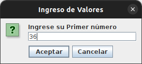
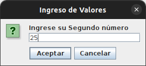
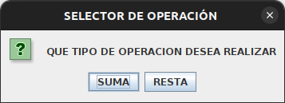
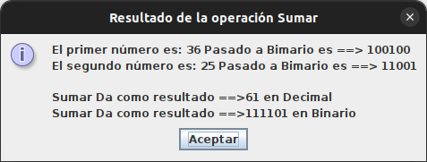
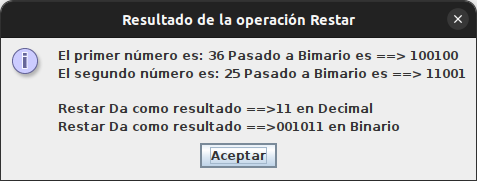

# Calculadora en Java con conversión de decimal a binario

Este proyecto es una calculadora básica en Java que permite realizar operaciones de suma y resta con números decimales y mostrar los resultados en binario.

## Funcionalidades principales

* Suma: Permite sumar dos números decimales y muestra el resultado en binario.
* Resta: Permite restar dos números decimales y muestra el resultado en binario.

## Uso

1. Ejecuta la clase `Main` para iniciar la calculadora.
2. Ingresa los dos números que deseas sumar o restar cuando se solicite.

 
3. Selecciona el tipo de operación que deseas realizar (suma o resta) a través del cuadro de diálogo emergente.

4. El resultado de la operación se mostrará en binario y decimal a través de otro cuadro de diálogo.
  

## Requisitos

* Java 11 o superior.
* Maven para gestionar las dependencias.

## Estructura del proyecto

El proyecto está estructurado de la siguiente manera:

* `Main.java`: Clase principal que inicia la calculadora y maneja las interacciones con el usuario.
* `Calculadora.java`: Clase que contiene la lógica para realizar las operaciones de suma y resta, así como la conversión de decimal a binario.
* `Calculos.java`: Clase que implementa las operaciones de suma y resta para números binarios.
* `Servicio.java`: Clase que proporciona funciones de utilidad para la interacción con el usuario, como ingreso de números y conversión de decimal a binario.
  
## Mejoras Futuras
### Código:
* Refactorización de métodos
* Manejo de excepciones
* Validación de entrada
* Utilizar enums
* Optimización de cálculos
### Arquitectura:
* Separación de responsabilidades
* Implementar patrón de diseño Strategy: Facilitará la incorporación de nuevas operaciones en el futuro.
* Agregar interfaz gráfica
* Implementar pruebas unitarias
* Mejorar manejo de números negativos

## Contribuciones

Las contribuciones son bienvenidas. Si deseas contribuir al proyecto, puedes enviar pull requests o abrir problemas para reportar errores o sugerir mejoras.

## Autor
* Nombre: Luis Alberto Espinoza.
* Correo electrónico: [espinoza.luis.alberto1981@gmail.com](mailto:espinoza.luis.alberto1981@gmail.com)
